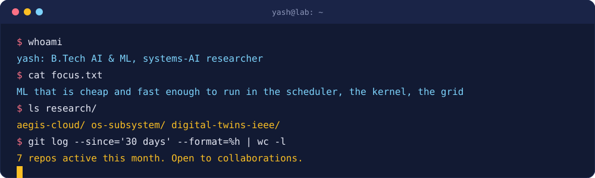
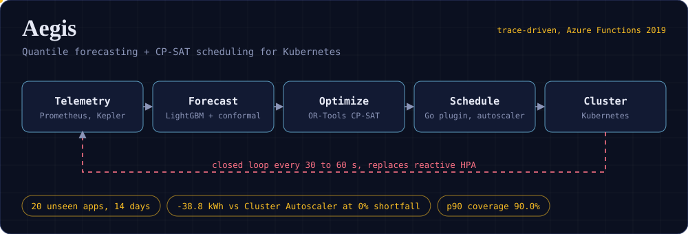
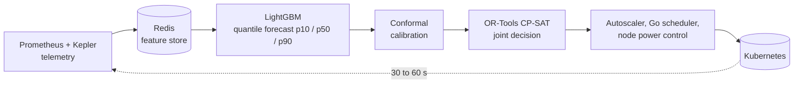
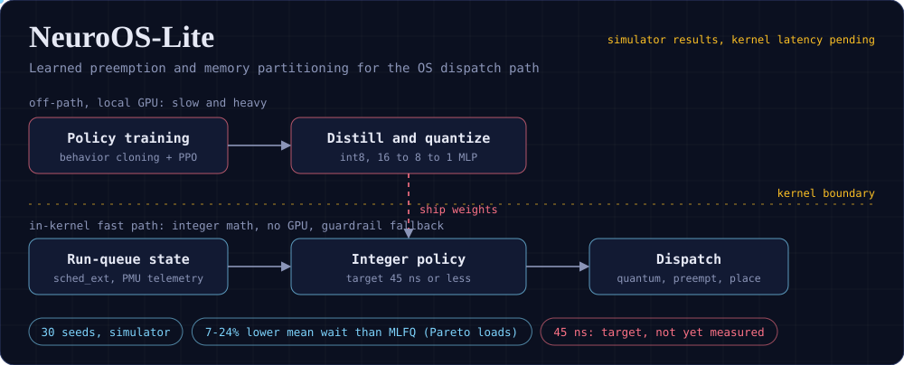
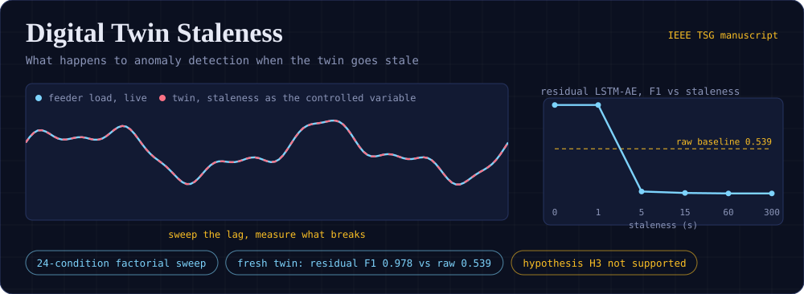
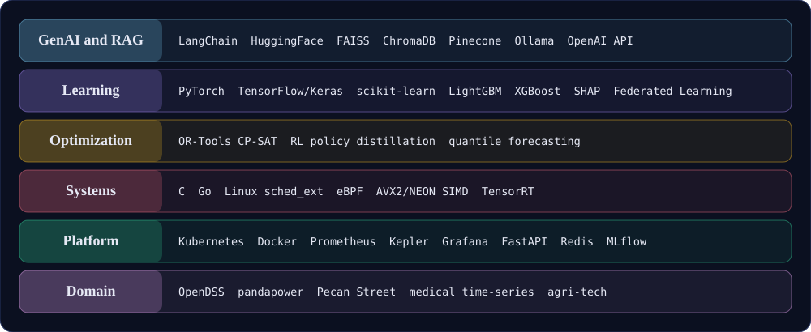

 

<a href="#research"><b>Research</b></a> &nbsp;|&nbsp; <a href="#recent-builds"><b>Recent builds</b></a> &nbsp;|&nbsp; <a href="#stack"><b>Stack</b></a> &nbsp;|&nbsp; <a href="#contact"><b>Contact</b></a>

  

  

 

| Investigating | Building | Looking for |
|:--|:--|:--|
| What happens to an ML decision when its input is late, stale, or too expensive to compute. | A predictive Kubernetes autoscaler, a learned OS scheduler, and a digital-twin staleness study, plus four applied systems for hackathons and networks. | Research collaborators, ML-systems internships, and teams that ship. |

## Research

Three projects, one thread: **latency decides whether a learned decision is useful.** Aegis forecasts load before it arrives, NeuroOS-Lite tries to make the decision fast enough to live in the kernel, and the Digital Twin study measures what breaks when the data arrives late. Each repo says what is measured and what is still a target.

 

<b>How Aegis works, and what the evaluation shows</b>

 

Kubernetes' HPA reacts to lagging averages, so scaling arrives after load has moved. Aegis forecasts first, optimizes second, and acts third, on a 30 to 60 second loop.

**Evaluation design.** 24,274 Azure Functions apps were filtered to 411 eligible, then 60 sampled with a fixed seed and split strictly by application: 30 train, 10 calibrate, 20 test. The test apps were never seen in training or calibration.

**Calibration.** Raw LightGBM p90 under-covers (86.8% median). Rolling conformal and adaptive conformal inference bring it to 90.0% and 89.9%.

**Energy at matched shortfall** (paired difference vs Cluster Autoscaler, 720 simulation runs, 10,000-sample bootstrap):

| Shortfall target | Calibration | Energy difference [95% CI] | Apps cheaper |
|:--|:--|--:|--:|
| 0.0% | Scale-aware | -16.7 kWh [-33.0, -2.7] | 70% |
| 0.0% | Rolling | -38.8 kWh [-62.4, -16.6] | 85% |
| 0.0% | ACI | -56.3 kWh [-80.7, -33.6] | 90% |

**Limits, stated in the repo.** Results come from trace-driven simulation with a Kepler-validated power model. Remaining shortfall concentrates on high-peak apps during step-function bursts (Spearman 0.87).

`Python` `Go` `LightGBM` `OR-Tools` `Kubernetes` `Prometheus` `Kepler` `Redis` `TimescaleDB` `Docker` `FastAPI`

 

<b>The overhead paradox, the split, and the honest numbers</b>

 

A learned scheduler only pays off if running the model costs less than the decisions it improves. Deep models take tens of microseconds, while a context switch takes about 1 to 2. NeuroOS-Lite splits the problem:

1. **Off the fast path:** behavior cloning plus PPO trains on a local GPU, then the policy is distilled to an int8 16 to 8 to 1 integer MLP.
2. **On the fast path:** the integer policy runs in the dispatch path with a guardrail that falls back to classical heuristics when queues saturate or predictions drift.

**Simulator results** (30 seeds, mean wait in microseconds, lower is better):

| Workload | MLFQ | Learned student | Change |
|:--|--:|--:|--:|
| Pareto, load 0.5 | 927.2 | 702.8 | -24.2% |
| Pareto, load 0.8 | 1333.1 | 1238.8 | -7.1% |
| Pareto, load 0.95 | 1731.7 | 1512.2 | -12.7% |
| Poisson, load 0.8 | 992.8 | 1059.1 | +6.7% |
| Multi-burst | 3797.0 | 6900.5 | +81.7% |

The student beats the realizable classical baselines on heavy-tailed loads, stays close to MLFQ on Poisson loads, and **fails on multi-burst workloads**, which the repo tracks as an out-of-distribution case. SRTF stays ahead, but it needs remaining-time knowledge a real kernel does not have.

**Not yet measured:** the 45 ns in-kernel inference figure is a design target. The rdtsc benchmark harness is written, and the hardware number is pending.

`C` `Python` `PyTorch` `PPO` `Linux sched_ext` `eBPF` `int8 quantization` `OR-Tools`

 

<b>Staleness as an experimental variable</b>

 

Most digital-twin work treats synchronization delay as an implementation detail. This study makes it the **independent variable** on the IEEE 33-bus feeder, and measures short-term load estimation and unsupervised anomaly detection under the same conditions. It sweeps 24 conditions: staleness from 0 to 300 s crossed with packet loss up to 20%.

The anomaly detector shows a cliff, not a slope. With a fresh twin, the residual LSTM Autoencoder reaches F1 0.978 against 0.539 for the raw-signal baseline. Once staleness passes about 5 s it drops to roughly 0.1, below the raw baseline.

The pre-registered hypothesis H3 (anomaly detection degrades more steeply than load estimation) was **not supported** in the 5-seed analysis, and the repo reports it that way.

`Python` `OpenDSS` `PyTorch` `scikit-learn` `XGBoost` `SHAP`

## Recent builds

| Project | Problem | Evidence | Built with |
|:--|:--|:--|:--|
| [**Enterprise Network Digital Twin**](https://github.com/yashlund05/enterprise-network-digital-twin-model) | Alarm floods and unclear blast radius in multi-tier networks. | 22 nodes, 44 links, 6 services, 15 fault scenarios. Root cause ranked first in 84.6% of single faults. 167 tests. | Python, graph algorithms |
| [**Forecast Blend**](https://github.com/yashlund05/forecast-blend-SIH) (SIH, MoES / NCMRWF) | Blending 3 physical weather models and 2 AI models with regime-aware weights. | 7.9% lower rain RMSE and 6.2% lower wind RMSE than a naive average. ECMWF IFS still wins on temperature, and the repo says so. 43 tests. | Python, SQLite, Streamlit |
| [**MarineDebris Sonar AI**](https://github.com/yashlund05/MarineDebris-Sonar-AI) (SIH 2026) | Finding debris in sonar imagery where cameras fail. | YOLOv8m, mAP@0.5 of 80.7% on 37 held-out frames, 44.6 ms per frame on CPU. 65 backend tests. | FastAPI, React, TypeScript, PyTorch |
| [**Voice Calculator**](https://github.com/yashlund05/business-voice-calculator) | Offline running total from spoken numbers, 0 to 2000. | Vosk with a constrained number grammar, 29 ms mean latency. On a 61-prompt phone benchmark, 91.8% of prompts end correct or safely rejected. | Python, Vosk, Windows |

### Earlier work

| Project | What it is |
|:--|:--|
| [Breast Cancer Incidence Forecasting](https://github.com/yashlund05/breast-cancer-incidence-forecasting-india) | Code and data for a JAIR paper on ML forecasting of breast cancer trends across Indian cancer registries. |
| [KrishiDrishti](https://github.com/yashlund05/KrishiDrishti-SIH) | Smart India Hackathon entry, ML predictions behind a TypeScript front end for agriculture. |
| [Project Ari](https://github.com/yashlund05/project_ari) | Fintech market-intelligence build for IIT Techkriti, with the Entropy Vanguard team. |
| [Automata Simulator](https://github.com/yashlund05/Automata-Simulator) | DFA, NFA and PDA simulation. |

## Stack

 

## Activity

<picture>
  <source media="(prefers-color-scheme: dark)" srcset="https://raw.githubusercontent.com/yashlund05/yashlund05/output/snake-dark.svg"/>
  <source media="(prefers-color-scheme: light)" srcset="https://raw.githubusercontent.com/yashlund05/yashlund05/output/snake.svg"/>
  
</picture>

## Contact

If you work on schedulers, autoscaling, energy-aware ML, or grid and network analytics, and want a collaborator who enjoys measuring things properly, write to me.

